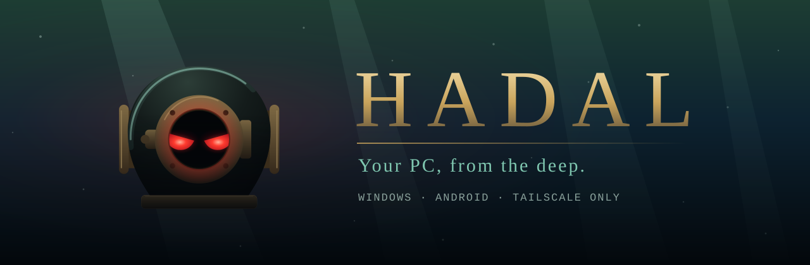
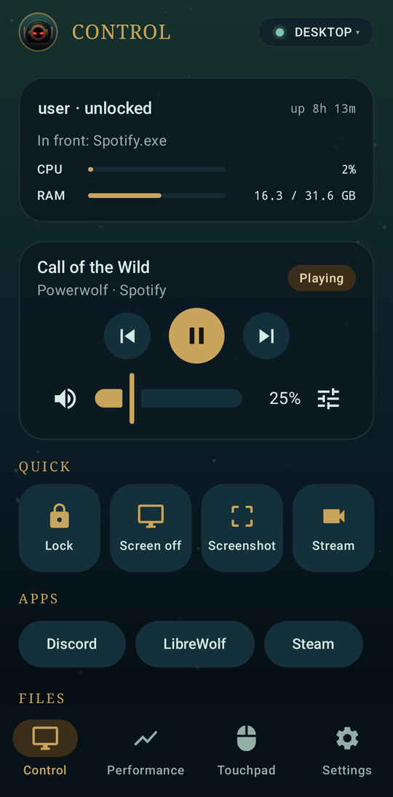
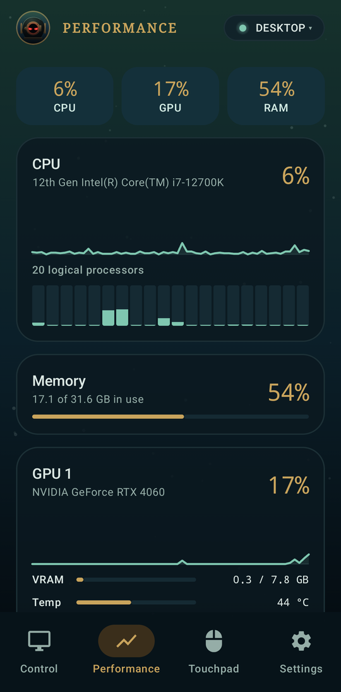
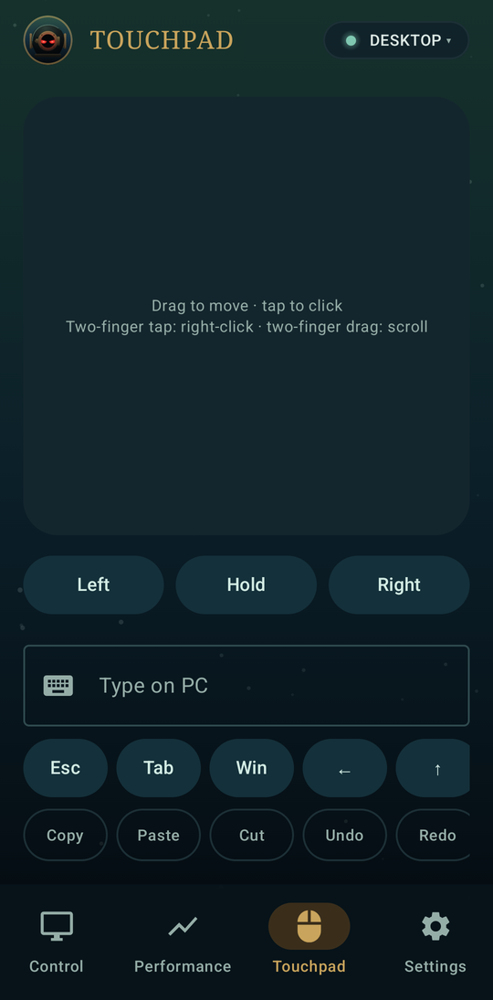
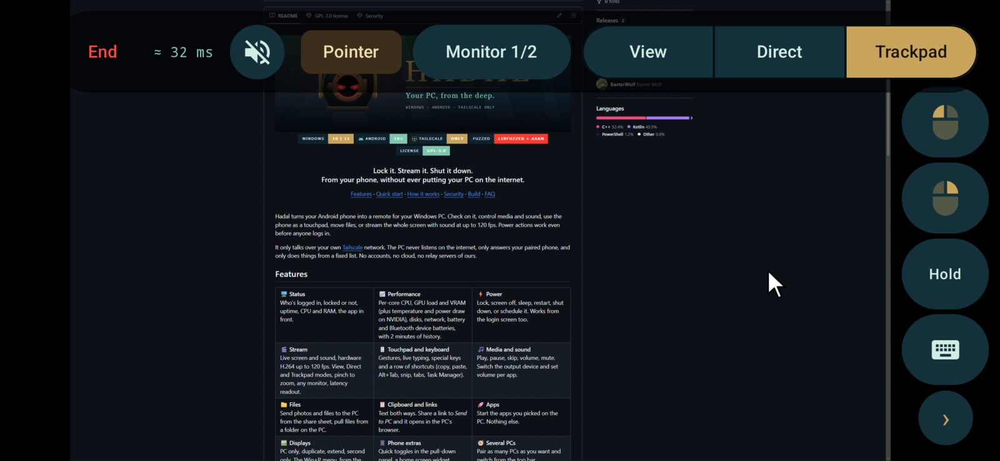
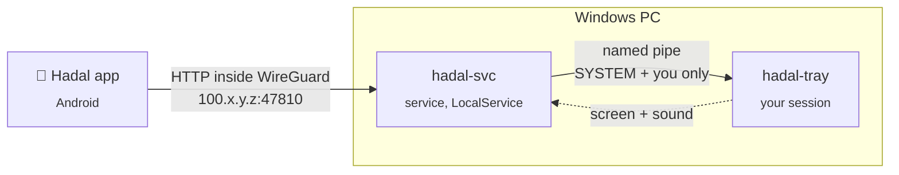

<div align="center">



<br>

<a href="#quick-start"></a>
<a href="#quick-start"></a>
<a href="#security"></a>
<a href="#fuzzing"></a>
<a href="LICENSE"></a>

<h3>Lock it. Stream it. Shut it down.<br>From your phone, without ever putting your PC on the internet.</h3>

<a href="#features">Features</a> · <a href="#quick-start">Quick start</a> · <a href="#how-it-works">How it works</a> · <a href="#security">Security</a> · <a href="#building-from-source">Build</a> · <a href="#faq">FAQ</a>

</div>

<br>

Hadal turns your Android phone into a remote for your Windows PC. Check on it, control media and sound, use the phone as a touchpad, move files, or stream the whole screen with sound at up to 120 fps. Power actions work even before anyone logs in.

It only talks over your own [Tailscale](https://tailscale.com) network. The PC never listens on the internet, only answers your paired phone, and only does things from a fixed list. No accounts, no cloud, no relay servers of ours.

<div align="center">
&nbsp;
&nbsp;

<br><br>

</div>

## Features

<table>
<tr>
<td width="33%" valign="top">

**🖥️ Status**<br>
Who's logged in, locked or not, uptime, CPU and RAM, the app in front.

</td>
<td width="33%" valign="top">

**📈 Performance**<br>
Per-core CPU, GPU load and VRAM (plus temperature and power draw on NVIDIA), disks, network, battery and Bluetooth device batteries, with 2 minutes of history.

</td>
<td width="33%" valign="top">

**⚡ Power**<br>
Lock, screen off, sleep, restart, shut down, or schedule it. Works from the login screen too.

</td>
</tr>
<tr>
<td valign="top">

**🎬 Stream**<br>
Live screen and sound, hardware H.264 up to 120 fps. View, Direct and Trackpad modes, pinch to zoom, any monitor, latency readout.

</td>
<td valign="top">

**🖱️ Touchpad and keyboard**<br>
Gestures, live typing, special keys and a row of shortcuts (copy, paste, Alt+Tab, snip, tabs, Task Manager).

</td>
<td valign="top">

**🎵 Media and sound**<br>
Play, pause, skip, volume, mute. Switch the output device and set volume per app.

</td>
</tr>
<tr>
<td valign="top">

**📁 Files**<br>
Send photos and files to the PC from the share sheet, pull files from a folder on the PC.

</td>
<td valign="top">

**📋 Clipboard and links**<br>
Text both ways. Share a link to *Send to PC* and it opens in the PC's browser.

</td>
<td valign="top">

**🚀 Apps**<br>
Start the apps you picked on the PC. Nothing else.

</td>
</tr>
<tr>
<td valign="top">

**🖼️ Displays**<br>
PC only, duplicate, extend, second only. The Win+P menu, from the couch.

</td>
<td valign="top">

**📱 Phone extras**<br>
Quick toggles in the pull-down panel, a home screen widget, fingerprint lock, landscape layout.

</td>
<td valign="top">

**🧭 Several PCs**<br>
Pair as many PCs as you want and switch from the top bar.

</td>
</tr>
</table>

## Quick start

> [!NOTE]
> You need [Tailscale](https://tailscale.com/download) on both the PC and the phone, logged into the same account.

**1. Tailscale on the PC.** Turn on *Run unattended* (tray → Preferences) so it connects before you log in. In the [admin console](https://login.tailscale.com/admin/machines), open your PC → *Disable key expiry*.

**2. Install on the PC.** Download `Hadal-PC.zip` from [Releases](../../releases), extract it, and double-click **`Install.cmd`**. Accept the UAC prompt. The helmet appears in the tray.

**3. Install on the phone.** Download `Hadal.apk` from the same release and open it on the phone.

**4. Pair.** Right-click the tray helmet → **Show pairing QR**, then tap **Scan pairing QR** in the app. Close the QR window afterwards, it contains the key.

That's it. Optional extras:

- **Quick toggles.** Swipe down twice from the top of the phone to open the toggle panel (Wi-Fi, Bluetooth...), tap *Edit*, and drag in *Lock PC*, *PC play/pause* or *PC monitors off*.
- **Widget.** Long-press your home screen → *Widgets* → *Hadal*.
- **Send links and files.** In any app, tap *Share* → *Send to PC*. Links open in the PC's browser, files land in `Downloads\Hadal`.

## How it works



- **`hadal-svc`** is a small Windows service. It listens on the PC's Tailscale address only, checks who's asking, does the power actions itself and samples performance. It runs as LocalService with every privilege removed except shutdown and the basic one every process needs to open folders.
- **`hadal-tray`** runs in your session. It does everything that needs your desktop: media, sound, input, clipboard, files, screenshots and the encoder for streaming. Every action from the phone shows up as a notification.
- **The app** is plain Kotlin and Jetpack Compose. Streams are decoded in hardware with MediaCodec.

No third-party libraries on the PC: just Win32, DXGI, Media Foundation and Core Audio.

## Security

Hadal is built on the idea that a remote control for your PC should be boring to attack.

| Layer | What it does |
|---|---|
| 🌐 **Network** | Listens only on the Tailscale IP. The firewall rule only allows `100.64.0.0/10`, and the code checks again. |
| 📌 **Phone pinning** | The first phone to log in after pairing is the only address the PC answers. Everyone else is refused before the key is even checked. |
| 🔑 **Key** | 256-bit random token, compared in constant time, stored on the phone encrypted with the Android Keystore. 10 wrong tries lock that device out for 5 minutes. |
| 📜 **Fixed actions** | The network protocol only accepts a fixed list of actions. No endpoint takes a shell command, and files only move through two fixed folders. |
| 🔒 **Least privilege** | The service keeps only the shutdown privilege, plus the basic one every process needs to open folders. Desktop work runs as you, behind a named pipe only SYSTEM, the service and you can open. |
| 🔔 **Visible** | Every action is logged and shows a notification on the PC. You can mute routine ones, but security alerts, streams and touchpad sessions always notify. |
| 👆 **App lock** | Optional fingerprint prompt every time the app opens. |

> [!IMPORTANT]
> **A paired phone has the same power as you sitting at the PC.** The touchpad, keyboard and screen stream reach everything your Windows session can: any program, any command you could type, anything on screen. The fixed action list limits what the network will accept, not what someone holding the phone can do with it. While Windows is locked, input, screenshots and streaming are refused.
>
> Treat the phone and its token like an unlocked PC: keep the app lock on, and regenerate the token if the phone is lost.

<details>
<summary><b>Lock your tailnet down to just the PC and the phone</b></summary>

<br>

Tailscale lets every device talk to every other one by default. In the [access controls](https://login.tailscale.com/admin/acls), replace the `grants` block (or `acls` on older tailnets) with this, using the IPs from `tailscale status`:

```jsonc
"hosts": {
  "pc":    "100.x.y.z", // your PC
  "phone": "100.a.b.c", // your phone
},
"grants": [
  { "src": ["phone"], "dst": ["pc"],    "ip": ["*"] },
  { "src": ["pc"],    "dst": ["phone"], "ip": ["*"] },
],
```

Rules are allow-lists, so any device not named here can't reach either machine.

</details>

<details>
<summary><b>Lost your phone?</b></summary>

<br>

1. Right-click the tray helmet → **Regenerate token**. The old key and the phone pin are gone instantly, and any live stream or touchpad session is cut off.
2. In the [Tailscale admin console](https://login.tailscale.com/admin/machines), remove the lost phone from your tailnet. That's what really locks it out: it can no longer reach the PC at all.
3. Pair the new phone with the fresh QR.

</details>

### Fuzzing

Everything a network peer can reach is fuzzed with libFuzzer and AddressSanitizer. The harness sends bursts of raw connections through the real request handler with a fake tray behind it. It fails not just on crashes but also when:

- a request makes the PC do something outside the fixed action list
- anything gets through without the key
- a device other than the paired phone gets past the pin

## Hadal vs the usual suspects

| | Remote desktop apps | Phone remote apps | **Hadal** |
|---|:---:|:---:|:---:|
| Live screen with sound | ✅ | ❌ | ✅ |
| Touchpad, media, power buttons | ➖ | ✅ | ✅ |
| Works before login | ➖ | ❌ | ✅ |
| Never listens on the internet | ➖ | ➖ | ✅ |
| Pinned to one phone | ➖ | ❌ | ✅ |
| No vendor account or cloud | ➖ | ➖ | ✅ |
| Games at Moonlight-level latency | ➖ | ❌ | ❌ |

For serious game streaming use [Moonlight](https://moonlight-stream.org) with Sunshine. Hadal is the remote for everything else.

## Building from source

Releases are built by GitHub Actions straight from the tagged source, never on someone's PC. The [release workflow](.github/workflows/release.yml) compiles the PC side with Visual Studio on a fresh Windows machine, runs the selftest, and builds the APK on a fresh Linux machine, signed with the project key. Every release links to the run that made it, so you can check exactly what went in.

Each release also lists the SHA-256 of every file and carries a signed build attestation, so you can prove a download came from that workflow:

```bash
gh attestation verify Hadal.apk --repo BaxterWolf/Hadal
```

To build it yourself:

<details>
<summary><b>PC</b> (Visual Studio 2022 with C++, x64)</summary>

<br>

```bash
cmake -S pc -B pc/build -A x64
```
```bash
cmake --build pc/build --config Release
```
```bash
pc\build\Release\hadal-svc.exe --selftest
```

Then double-click `pc\Install.cmd`. It picks up the exes from `pc\build\Release`. Running it again updates in place and keeps your pairing.

</details>

<details>
<summary><b>Android</b> (Android Studio's JDK, nothing else)</summary>

<br>

```bash
cd android && gradlew.bat assembleRelease
```

Release builds are signed with a key kept outside the repo: `HADAL_KEYSTORE` and `HADAL_KEY_PASSWORD` in `~/.gradle/gradle.properties`. Back the key up. Without it, updates mean uninstalling and pairing again.

</details>

<details>
<summary><b>Fuzzer</b> (MSVC's libFuzzer + ASan, run from a Developer prompt)</summary>

<br>

```bash
cmake -S pc -B pc/build-fuzz -DHADAL_FUZZ=ON
```
```bash
cmake --build pc/build-fuzz --config Release --target hadal-fuzz
```
```bash
mkdir pc\fuzz-corpus & pc\build-fuzz\Release\hadal-fuzz.exe pc\fuzz-corpus pc\fuzz-seeds -dict=pc\fuzz.dict -max_len=65536 -jobs=16 -workers=16
```

</details>

<details>
<summary><b>Repo layout</b></summary>

<br>

| Path | What |
|---|---|
| `pc/svc.cpp` | Service: listener, auth, routes, power, performance, pipe server |
| `pc/tray.cpp` | Tray app: menu, pairing QR, notifications, all desktop actions |
| `pc/stream.cpp` | Screen capture, hardware H.264, sound |
| `pc/fuzz.cpp` | Fuzz harness |
| `pc/Install.cmd`, `pc/Uninstall.cmd` | Double-click install and uninstall |
| `pc/install.ps1`, `pc/uninstall.ps1` | Everything that touches the system, in one place each |
| `android/.../Main.kt` | The app: Control, Performance, Touchpad, Settings, tiles, widget |
| `android/.../Stream.kt` | The stream screen |
| `android/.../Theme.kt` | Colours and type |

</details>

## FAQ

<details>
<summary><b>iPhone? Mac? Linux?</b></summary>

<br>

Not yet. Hadal is Windows on the PC side and Android on the phone side.

</details>

<details>
<summary><b>Why Tailscale?</b></summary>

<br>

It gives your phone and PC a private, encrypted network that works from anywhere, without opening ports or trusting a relay. Hadal leans on it so it never has to face the internet.

</details>

<details>
<summary><b>Does it work away from home?</b></summary>

<br>

Yes, anywhere both devices have internet. On slow connections set the stream bitrate to 3-6 Mbit/s in Settings.

</details>

<details>
<summary><b>The touchpad does nothing in some games</b></summary>

<br>

Some anti-cheat systems block remote input while their game runs. Windows also won't let it reach programs running as administrator, such as Task Manager or installers. You'll get a notification on the PC the first time it's blocked.

</details>

<details>
<summary><b>Why isn't the PC reachable when it's asleep?</b></summary>

<br>

A sleeping PC isn't on the network. Wake-on-LAN needs an always-on device on the same LAN, which is on the roadmap.

</details>

<details>
<summary><b>Does it work for other Windows accounts on the PC?</b></summary>

<br>

Partly. Hadal is set up for the account that installed it. Sleep, restart, shut down and status work whoever is logged in, but everything that needs the desktop (lock, touchpad, streaming, media, files, clipboard) only works while that account is signed in. To move Hadal to another account, uninstall it, then install it again from that account.

</details>

<details>
<summary><b>How do I uninstall it?</b></summary>

<br>

Double-click **`Uninstall.cmd`** in `C:\Program Files\Hadal` and accept the UAC prompt. It removes the service, the firewall rule, the startup entry, the program files and the settings. Files you transferred stay in `Downloads\Hadal`. On the phone, uninstall the app like any other.

</details>

## License

[GPL-3.0](LICENSE). Use it, change it, share it. If you distribute a modified version, its source has to stay open under the same license. Found a security issue? See [SECURITY.md](SECURITY.md).

<br>

<div align="center">
<sub>Made for the deep end of your desk.</sub>
</div>
